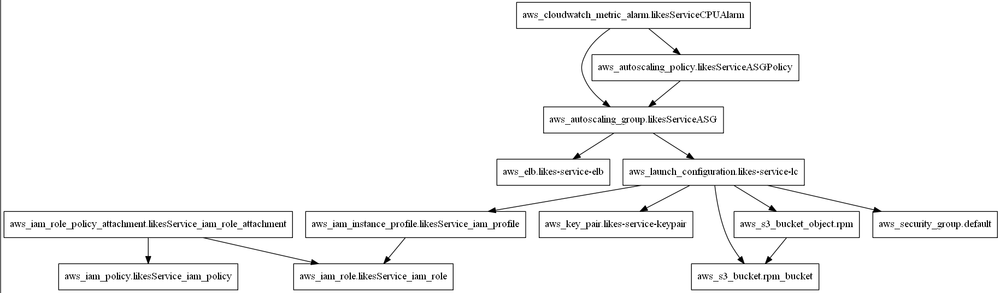

# Abstract
This is an example of how autoscaling can be built in AWS cloud and additionally how load testing can be performed using the same stack of technologies.

# Method
Here are most important parts of what's done:

1. Service to load test, - Sprint Boot service that stores Likes count users set to each other. See LikesService for details.
2. Service deployment code, - terraform scripts to create autoscaling infrastructure for service from scratch. See ServiceDeployment for details.
3. Load testing scripts, - terraform scripts to create a load on the service in question. See LoadTest for details.

# Prerequisites

To build server:

1. Gradle 2.4
2. Java 8+

To deploy and load test

1. HashiCorp Terraform
2. AWS account
3. ssh client
4. Tool to create ssh keys (e.g. ssh-keygen)

# LikesService

## API

1. POST /v1/<userId>/likes, - adds like to a user
2. GET /v1/<userId>/likes, - gets amount of likes for a user
3. GET /v1/healthcheck, - returns { "healthy": true } if healthy

## Principles

1. REST over HTTP as a protocol
2. Spring boot as a framework
3. DynamoDB to store data, - N.B. There is the whole science behind creating really distributed counters but it's not very important for our example, - let's assume that scaling based on separate counters per user is enough, - see links for details!
4. Gradle as a build system
5. Packaged in RPM

# ServiceDeployment

1. Creates S3 bucket and uploads RPM into it
2. Creates launch configuration with user_data which downloads and setups service RPM
3. Creates security group, assigns IAM policy to instances, manages tagging
4. Creates AWS autoscaling group and autoscaling policies
5. Here's how the end graph looks:

## How to install
1. Generate ssh public and private keys in ServiceDeployment/ssh folder - `ssh-keygen -t rsa -C "likesService" -P '' -f likesService`
2. Populate ServiceDeployment/terraform.tfvars with aws access and secret keys
3. Build the project with `gradle clean rpm` in LikesService folder
4. Go to ServiceDeployment folder and run `terraform apply`. N.B. You might want to review the changes first with `terraform plan` command.

# LoadTest

## Principles

1. jMeter as a core component
2. Based on terraform-aws-jmeter terraform module (see links)

## How to run

1. Generate ssh public and private keys in LoadTest/ssh folder `ssh-keygen -t rsa -C "loadServer" -P '' -f loadServer`
2. Populate LoadTest/terraform.tfvars with aws access and secret keys
3. Run `terraform apply` in LoadTest folder. N.B. You might want to review the changes first with `terraform plan` command.
4. SSH to master node and start the load testing (see documentation on terraform-aws-jmeter for details)

# Links

1. http://highscalability.com/blog/2014/3/12/paper-scalable-eventually-consistent-counters-over-unreliabl.html
2. https://www.terraform.io/docs/providers/aws/r/cloudwatch_metric_alarm.html
3. http://jmeter.apache.org/usermanual/remote-test.html
4. https://github.com/r4dx/terraform-aws-jmeter